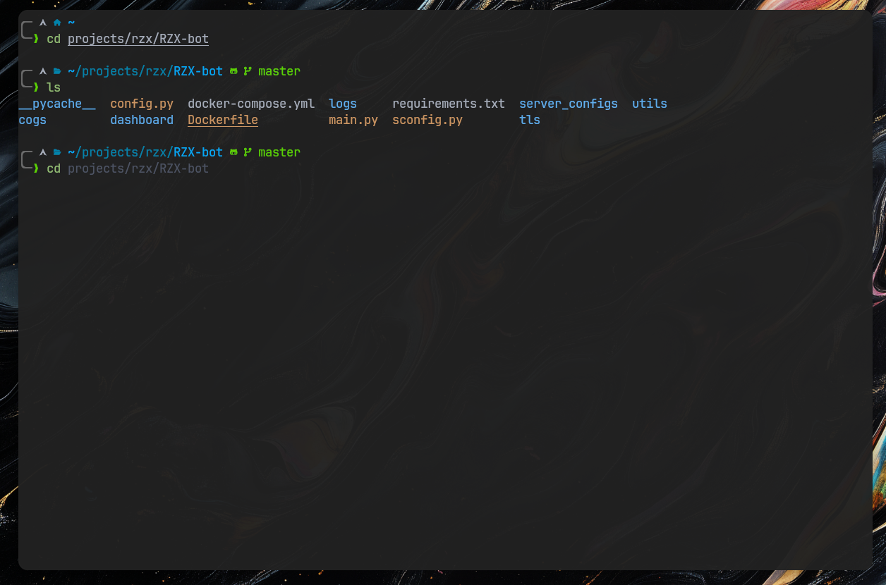
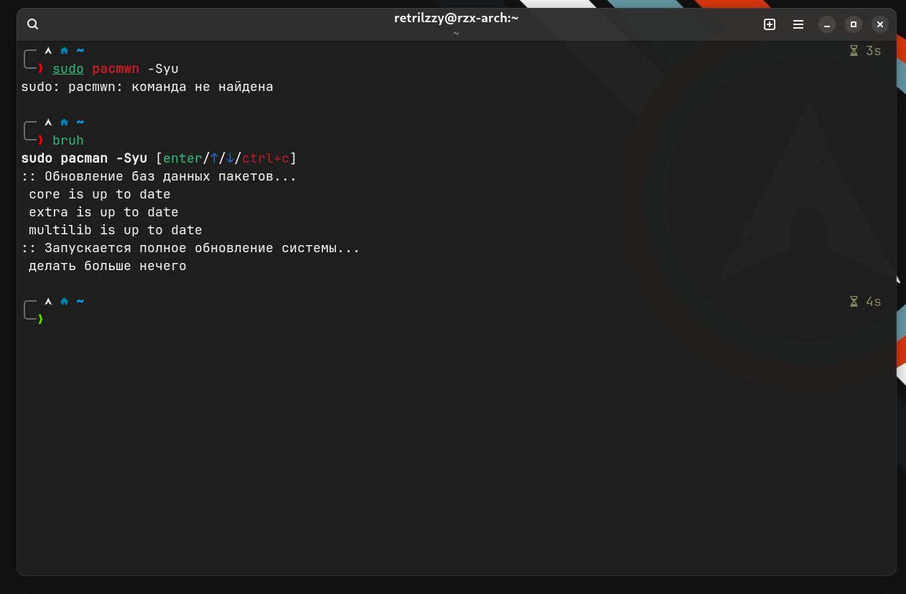

## Настройка терминала

**[Kitty](https://sw.kovidgoyal.net/kitty/)
|
[ZSH](https://www.zsh.org/)
|
[Oh My ZSH](https://ohmyz.sh/)**



### Конфиг терминала [Kitty ↗](../kitty)

## Тема [powerlevel10k](https://github.com/romkatv/powerlevel10k)

Конфиг темы: [.p10k.zsh](.p10k.zsh)

*Для быстрой конфигурации темы по своему вкусу можно использовать `p10k configure`*

**Плагины:**
```
plugins=(git zsh-syntax-highlighting zsh-autosuggestions dirhistory)
```

GitHub репозитории плагинов: <br>
[zsh-syntax-highlighting](https://github.com/zsh-users/zsh-syntax-highlighting)
|
[zsh-autosuggestions](https://github.com/zsh-users/zsh-autosuggestions)

## Прекрасное приложение [The F*ck](https://github.com/nvbn/thefuck)



[.zshrc](.zshrc)
```
eval "$(thefuck --alias bruh)"
```


## [exa](https://the.exa.website/) вместо ls

[.zshrc](.zshrc)
```
if [ -x "$(command -v exa)" ]; then
    alias ls="exa"
    alias la="exa --long --all --group"
fi7
```

## Вид окна
**Для прозрачности терминала можно использовать:**
- Расширения gnome - [BlurMyShell](https://github.com/aunetx/blur-my-shell)
- В конфиге kitty указать прозрачность окна - [Kitty Docs](https://sw.kovidgoyal.net/kitty/conf/#opt-kitty.background_opacity)

**Для блюра окна можно использовать тот же [BlurMyShell](https://github.com/aunetx/blur-my-shell)**
